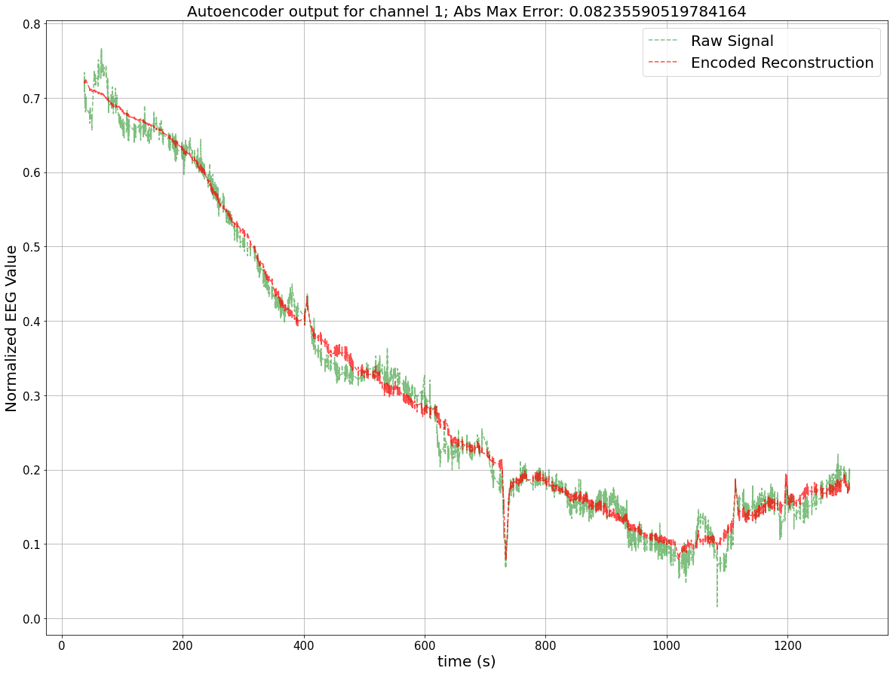
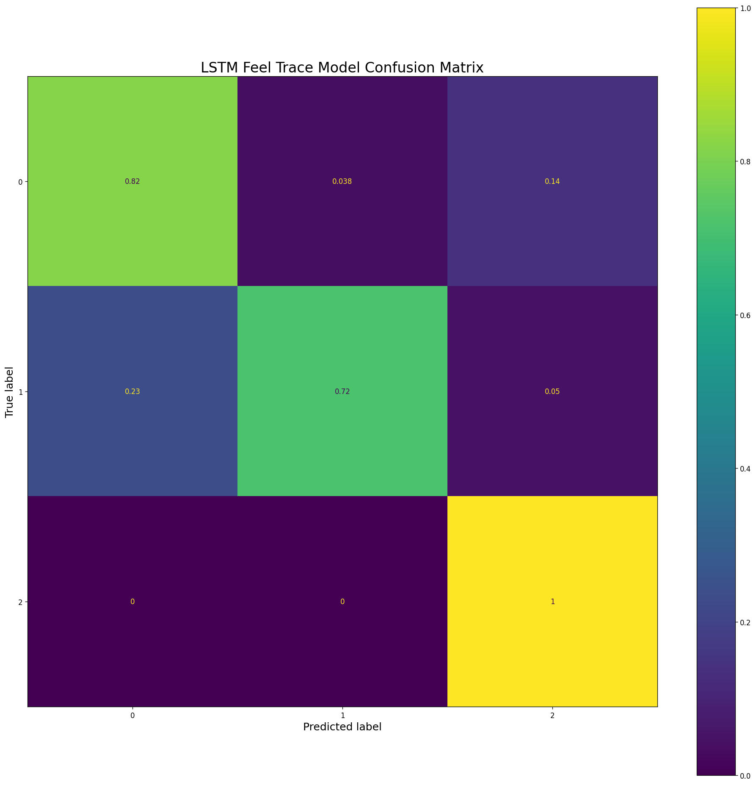
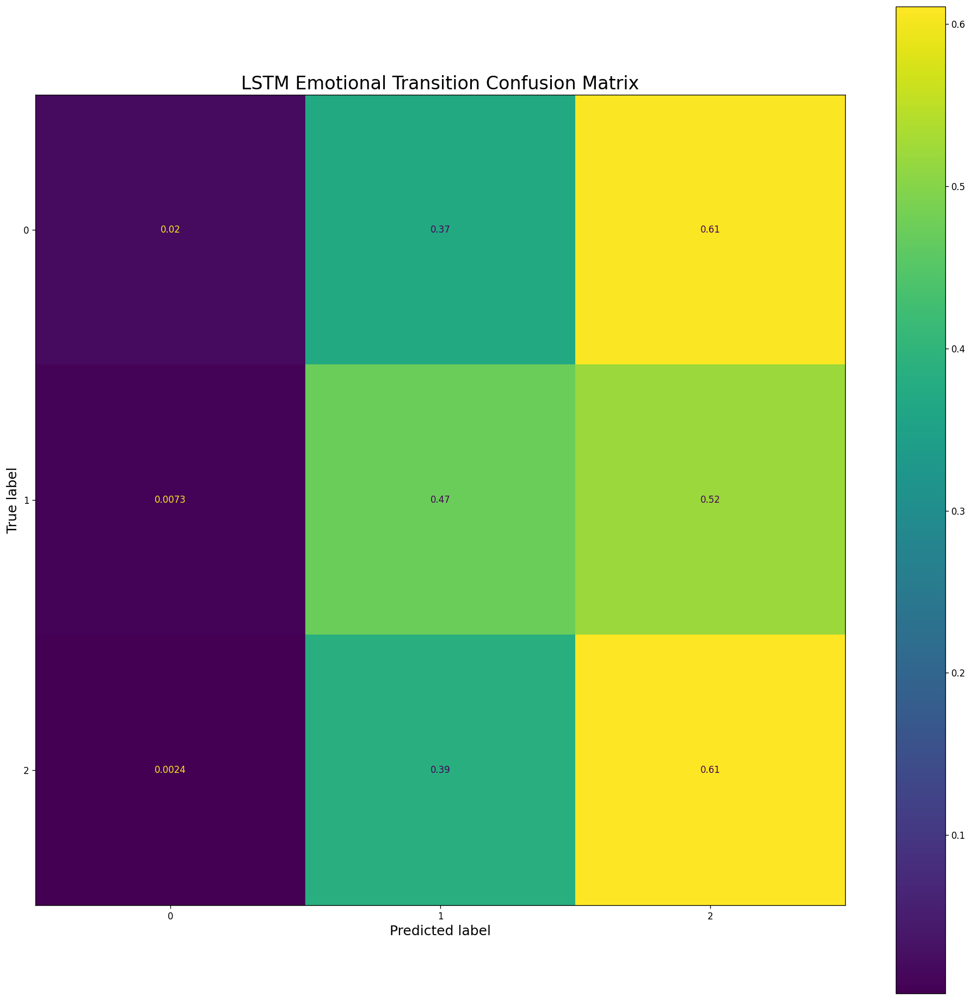

# EEG Stress Classification 

This is a project sponsored by the SPIN lab at UBC. The goal of the project is to use the captured EEG and stress response data from previous experiments
to create a state-of-the-art model that can correctly classify the stress from the EEG input.

Unprocessed EEG data is contained int the RAW_EEG folder, while the normalized EEG data is contained in the EEG_FT_DATA folder.

## Autoencoder Feature Generation

## Classifying Stress Level [100 ms timewindows; low/med/high]

## Classifying Stress Transition [100 ms timewindows; decrease/no-change/increase]

